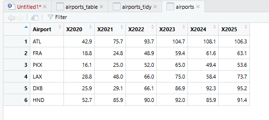
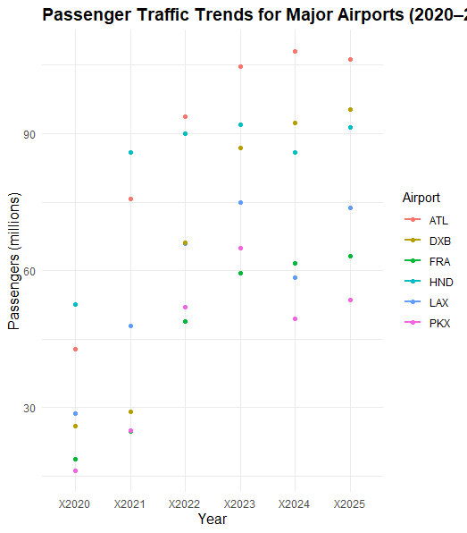
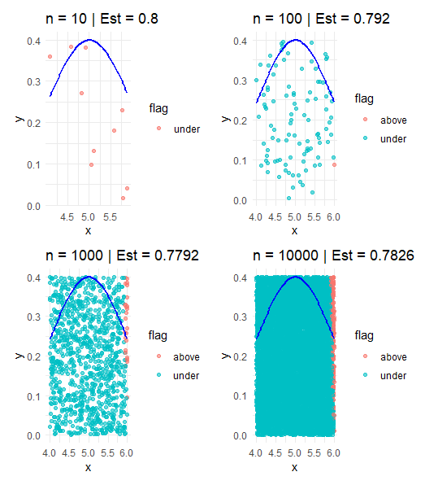

# Busiest Airports

## Table

{fig-width=6}

## Plot

{fig-width=6}

## Interpretation

The table summarizes passenger traffic across major airports, while the plot provides a visual comparison of trends over time.

From the visualization, it is clear that some airports consistently handle higher passenger volumes than others. The plot highlights trends more clearly than the table, while the table provides exact numerical values.

Together, these visuals help identify patterns and differences in airport traffic.

---

# Monte Carlo Numeric Integration

## Plot

{fig-width=7}

## Interpretation

Monte Carlo simulation estimates the area under a curve using random sampling. Each point is classified as either under the curve or above it.

As the number of points increases, the estimate stabilizes near approximately 0.78. Smaller sample sizes show more variation, while larger samples produce more accurate and consistent estimates.

This demonstrates that increasing the number of simulations improves accuracy and reliability.


---

\newpage

# Appendix A: GenAI Usage

Tool: ChatGPT  
Date: April 2026  

## Usage 1
Prompt:
"Help structure a Quarto document."

Response:
Provided section organization and formatting guidance.

## Usage 2
Prompt:
"Explain Monte Carlo simulation."

Response:
Explained how random sampling estimates values.

## Usage 3
Prompt:
"Improve explanation of plots."

Response:
Helped refine interpretation text.

---

\newpage

# Appendix B: Code Appendix

```{r}
#| label: code-appendix
#| echo: true
#| eval: false

# Full R code used for this project

# Appendix B: Code Appendix

(All code used in this assignment is included below.)

library(ggplot2)

ggplot(diamonds, aes(x = carat, y = price)) + geom_point(alpha = 0.3) + labs(title = "Diamond Price vs Carat", x = "Carat", y = "Price") + theme_minimal()

library(ggplot2)

ggplot(diamonds, aes(x = carat, y = price, color = cut)) + geom_point(alpha = 0.4) + scale_y_log10() + labs( title = "Diamond Price vs Carat by Cut", x = "Carat", y = "Price (log scale)", color = "Cut Quality" ) + theme_minimal() + theme( plot.title = element_text(size = 14, face = "bold"), axis.title = element_text(size = 12) )

install.packages("yarrr") library(ggplot2) library(yarrr)

ggplot(pirates, aes(x = age, y = tattoos)) + geom_point(alpha = 0.5) + labs( title = "Pirate Age vs Tattoos", x = "Age", y = "Number of Tattoos" ) + theme_minimal()

library(ggplot2) library(yarrr)

ggplot(pirates, aes(x = age, y = tattoos, color = sex)) + geom_point(alpha = 0.5) + geom_smooth(method = "lm", se = FALSE) + labs( title = "Pirate Age vs Tattoos by Sex", x = "Age", y = "Number of Tattoos", color = "Sex" ) + theme_minimal() + theme( plot.title = element_text(size = 14, face = "bold"), axis.title = element_text(size = 12) )

library(dplyr) library(tidyr)

# Create dataset manually (passenger traffic in millions)

airports \<- data.frame( Airport = c("ATL", "FRA", "PKX", "LAX", "DXB", "HND"), `2020` = c(42.9, 18.8, 16.1, 28.8, 25.9, 52.7), `2021` = c(75.7, 24.8, 25.0, 48.0, 29.1, 85.9), `2022` = c(93.7, 48.9, 52.0, 66.0, 66.1, 90.0), `2023` = c(104.7, 59.4, 65.0, 75.0, 86.9, 92.0), `2024` = c(108.1, 61.6, 49.4, 58.4, 92.3, 85.9), `2025` = c(106.3, 63.1, 53.6, 73.7, 95.2, 91.4) )

# Convert to tidy format

airports_tidy \<- airports %\>% pivot_longer( cols = -Airport, names_to = "Year", values_to = "Passengers" ) %\>% mutate( Year = as.numeric(Year), Passengers = as.numeric(Passengers) )

# View cleaned data

print(airports_tidy)

library(dplyr) library(tidyr)

# Create table (wide format for comparison)

airports_table \<- airports_tidy %\>% pivot_wider( names_from = Year, values_from = Passengers ) %\>% arrange(Airport)

# View table

airports_table

airports_tidy \<- airports %\>% pivot_longer( cols = -Airport, names_to = "Year", values_to = "Passengers" )

airports_tidy$Year <- as.numeric(airports_tidy$Year)

library(ggplot2) library(dplyr)

# Line plot for passenger trends

ggplot(airports_tidy, aes(x = Year, y = Passengers, color = Airport)) + geom_line(linewidth = 1) + geom_point() + labs( title = "Passenger Traffic Trends for Major Airports (2020–2025)", x = "Year", y = "Passengers (millions)", color = "Airport" ) + theme_minimal() + theme( plot.title = element_text(size = 14, face = "bold"), axis.title = element_text(size = 12) )

monte_carlo_sim \<- function(n, xmin, xmax, ymin, ymax) {

\# Generate random x and y values x \<- runif(n, xmin, xmax) y \<- runif(n, ymin, ymax)

\# Define the function (example: f(x) = -(x - 4)\^2 + 4) f \<- function(x) { -(x - 4)\^2 + 4 }

\# Determine if points are under the curve under_curve \<- y \<= f(x)

\# Create data frame data.frame( x = x, y = y, under_curve = under_curve ) } install.packages("roxygen2") library(roxygen2) \#' Monte Carlo Simulation for Numerical Integration \#' \#' This function performs a Monte Carlo simulation to estimate the area under a curve. \#' \#' @param n Number of random points \#' @param xmin Minimum x-value \#' @param xmax Maximum x-value \#' @param ymin Minimum y-value \#' @param ymax Maximum y-value \#' \#' @return A data frame with x, y, and under_curve \#' \#' @examples \#' monte_carlo_sim(1000, 2, 6, 0, 4) monte_carlo_sim \<- function(n, xmin, xmax, ymin, ymax) { x \<- runif(n, xmin, xmax) y \<- runif(n, ymin, ymax)

f \<- function(x) { -(x - 4)\^2 + 4 }

under_curve \<- y \<= f(x)

data.frame(x = x, y = y, under_curve = under_curve) } roxygen2::roxygenise()

library(dplyr) library(ggplot2)

# Use your existing function output

set.seed(123) sim_data \<- monte_carlo_sim(1000, 4, 6, 0, 0.4)

# Define the Gaussian PDF

f \<- function(x) { dnorm(x, mean = 5, sd = 1) }

# Add classification column

sim_data \<- sim_data %\>% mutate(flag = ifelse(under_curve, "under", "above"))

# Estimate integral

rect_area \<- (6 - 4) \* (0.4 - 0) p_hat \<- mean(sim_data\$under_curve) estimate \<- rect_area \* p_hat

# Plot

ggplot(sim_data, aes(x = x, y = y, color = flag)) + geom_point(alpha = 0.6) + stat_function(fun = f, color = "blue", size = 1) + labs( title = paste("Monte Carlo Estimate =", round(estimate, 4)), x = "x", y = "y", color = "Point Type" ) + theme_minimal() install.packages("patchwork") library(ggplot2) library(dplyr) library(patchwork)

set.seed(123)

# Gaussian function

f \<- function(x) { dnorm(x, mean = 5, sd = 1) }

# helper to create one plot

make_plot \<- function(n) { sim_data \<- monte_carlo_sim(n, 4, 6, 0, 0.4)

sim_data \<- sim_data %\>% mutate(flag = ifelse(under_curve, "under", "above"))

rect_area \<- (6 - 4) \* (0.4 - 0) p_hat \<- mean(sim_data\$under_curve) estimate \<- rect_area \* p_hat

ggplot(sim_data, aes(x = x, y = y, color = flag)) + geom_point(alpha = 0.6) + stat_function(fun = f, color = "blue", size = 1) + labs( title = paste("n =", n, "\| Est =", round(estimate, 4)), x = "x", y = "y" ) + theme_minimal() }

# Create plots

plot10 \<- make_plot(10) plot100 \<- make_plot(100) plot1000 \<- make_plot(1000) plot10000 \<- make_plot(10000)

# Combine

plot10 + plot100 + plot1000 + plot10000

## 
